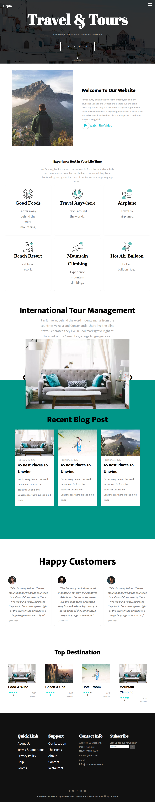

# Hepta Travel & Tours Template

A modern, responsive travel and tours website template featuring a clean design and comprehensive functionality.



## Features

- 📱 Fully Responsive Design
- 🎨 Modern UI/UX
- 🔍 Interactive Navigation
- 🖼️ Image Sliders
- 💬 Customer Reviews Section
- 🌟 Top Destinations Showcase
- 📰 Blog Section
- 📧 Newsletter Subscription
- 🔗 Social Media Integration

## Project Structure

```
hepta-template/
├── css/
│   ├── StyleSheet1.css
│   └── fontawesome-free-6.5.2-web/
├── images/
│   ├── 001-breakfast.svg
│   ├── 002-planet-earth.svg
│   └── [other images]
└── index.html
```

## Sections

### 1. Hero Section
- Dynamic welcome message
- Call-to-action button
- Scroll down indicator

### 2. Welcome Section
- Company introduction
- Video integration
- Engaging content

### 3. Services
- 6 key service offerings
- Icon-based presentation
- Descriptive content

### 4. International Tour Management
- Image slider
- Tour descriptions
- Interactive navigation

### 5. Blog Section
- Recent blog posts
- Date metadata
- Featured images

### 6. Customer Reviews
- Customer testimonials
- Profile pictures
- Star ratings

### 7. Top Destinations
- Featured locations
- Rating system
- Review counts

### 8. Footer
- Quick links
- Contact information
- Newsletter subscription
- Social media links

## Technologies Used

- HTML5
- CSS3
- JavaScript
- Font Awesome Icons
- Google Fonts

## Browser Support

- Chrome (latest)
- Firefox (latest)
- Safari (latest)
- Edge (latest)
- Opera (latest)

## Credits

- Design inspiration by [Colorlib](https://colorlib.com)
- Icons by Font Awesome
- Fonts by Google Fonts

## License

open source license by Eng Hussien Shokry